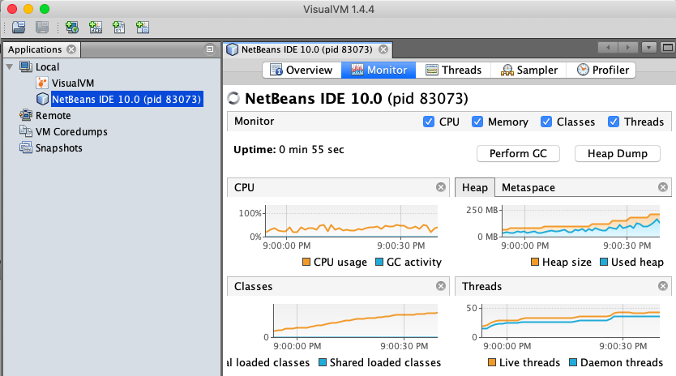
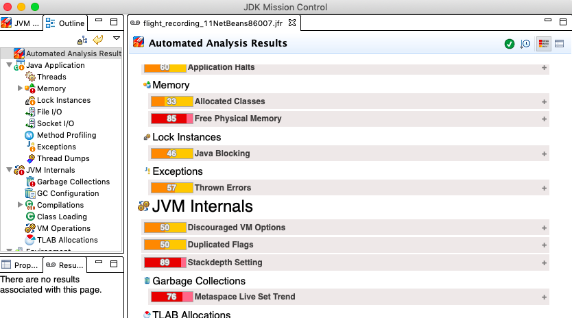

# 1.2 Javaにおけるパフォーマンス分析と障害診断

Oracle JDKを含むOpenJDKディストリビューション(以下、JavaまたはJDK)にはJFR以外にも様々な分析用の方法/ツールがあります。

本章ではJavaにおける基本的なメトリクス取得のアプローチを紹介していきます。

## メトリクス取得のための仕組み

Javaにはパフォーマンスメトリクスを取得するための方法がいくつかあります。代表的なのは下記の3つでしょう。

- JMX
- ログ
- JPLIS(javaagent)

### JMX

Java Management Extensions(JMX)はJavaのリソース監視および管理のためのプロトコルです。簡単にいえばJava版のSNMPです。
JSR-174としてJava 1.5より取り込まれています。

Managed Bean(MBean)を利用してCPUやメモリの情報を取得したり、特定のイベント(例えば強制GC)とかを実行することも可能です。

MBeanを自前で定義する事もでき、元々JavaEEから始まった技術という事もあってWeblogicやGlassFishと言った多くのアプリケーションコンテナがスレッド数や待機リクエスト数など様々なメトリクスをJMXで取得できるようにしています。そのため、Java製のアプリケーションを監視するときの最も基本的な選択肢となります。

ただし、近年では独自プロトコルは監視ツール側との連携がしづらいと言う点からJMXをHTTPベースに変換するOSSのJolokiaや、JMXに代わる新しいメトリクス取得インターフェースであるEclipse Microprofile Metricsなどが登場しています。

### ログ

JavaではGCなどの詳細なログをJVMより取得することができます。元々、Javaはバージョンアップと共に様々なシステムログが取れるように進化してきたのですが、一貫性がなくそれぞれのログフォーマットや設定方法を覚える必要がありました。

しかし、Java 9よりUnified JVM Loggingとしてシステムログに関する仕様が統合されています。結果として、利便性は上がったのですがJava 8の頃とオプション等が違うので古いドキュメントを見たりする時は注意してください。

例えばGCログなら以下のようにJVMオプションに指定することでログファイルに出力されます。

```bash
-Xlog:gc*=debug:/path/to/gc_%p_%t.log:time,level,tags:filesize=100m,filecount=7
```

また、スレッドダンプをログファイルに定期的に出したいと言うニーズもあるかと思いますが、これはJVMのログ機能ではできません。そのため、後述する`jstack`や`jcmd`、あるいは`kill -3`を定期的に実行してファイルに書き込むコマンドを作るのが一般的でした。

ただ、JFRを使うならJFR側にスタックトレースが含まれているのでそちらで十分でしょう。

### JPLIS(javaagent)

Java Programming Language Instrumentation Services(JPLIS)は`java.lang.instrument`と言う、あまり聞き慣れないパッケージに連携するためのインターフェースです。`javaagent`をJMVオプションとして指定する事で利用します。

これはJVMがクラスをロードするタイミングでエージェントがクラスの情報を書き換えるAPIとなります。これを使ってJavaのオブジェクト情報を取得したり、プロファイリング用のアスペクトを埋め込んでトレース情報を取得するなどの使い方があります。

資料が少ないのが難点ですがAspectJなどと組み合わせると比較的簡単に利用できます。

原理上ほぼどんな値でも取れるので、多くのAPMはこのJavaエージェントを使用して実装されています。ただしバイトコードを書き換える特性上、広範囲に原因特定のし難いバグを発生させるリスクがあるので、テスト/デバックは入念に行って利用しましょう。

## JDK標準ツール

サードパーティのツールもありますが、Javaには分析や診断のためのツールがデフォルトで用意されています。

### VisualVM

Java Mission ControlがJDKに統合されるまでHotSpotの主力だったプロファイリングツールです。OSS版は下記で開発されています。

https://visualvm.github.io/index.html



NetBeans Platformをベースにしているためプラグイン構造を持っているのが特徴の一つです。

JMXの情報のモニタリングしCPUやメモリ/GCなどさまざまな情報をリアルタイムかつグラフィカルに見る事ができます。またヒープダンプを出力したり解析情報のスナップショットをとったりとかなり高機能なツールです。

JMCがHotSpotにも同梱されるようになって以来少し影が薄くなりましたが、GraalVMにも対応しており最新版ではプレビュー版ながらJFRにも対応したようなので今後が改めて気になるツールです。

### JDK Mission Control(JMC)

現状のJavaでは主流のプロファイリングツールです。OSS版は下記で開発されています。

https://github.com/JDKMissionControl/jmc



元々、JRockit Mission Controlと呼ばれJRockitで定評のあったプロファイリングツールをOracleのSunの買収をきっかけにHotSpot側に取り込んだツールとなります。

同じくJRockit由来のJFRと密接に連携。。。と言うかJFRのビジュアライズツールとしてはほぼ一択の状態です。

機能としてはVisualVMと同様に統合分析ツールとなっておりリアルタイムのJMX監視やヒープダンプおよびJFRの取得/分析が可能です。

VisualVMとは対照的にEclipseのGUIフレームワークをベースにしており、同じく柔軟なプラグイン機能を備えます。Weblogicなど製品に特化したプラグインが存在しているのも特徴の一つです。

HotSpotへの移植およびOSS化に伴って「JRockit Mission Control」 -> 「Java Mission Control」 -> 「JDK Mission Control」と名前が変わっていますが略称はJMCのままです。

また、オープン化されたJMC 7よりUIが大きく変わっており、自動分析の機能も強化されています。

ただし、執筆時点の2019/10/06時点でまだ正式版がリリースされておらず公式からバイナリがダウンロードでき無いため自分でビルドする必要があると言う状態が続いています。

当面はOpenJDKディストリビュータがビルドしている「AdoptOpenJDK Mission Control」「Zulu Mission Control」「Liberica Mission Control」あたりを使うのが良いでしょう。

### jcmd

jcmdはJFRと同様に元々はJRockitで使われていたコマンドです。Sunが開発したHotSpotにも多くの管理ツールが提供されていましたが、コマンドがバラバラだっためjcmdを導入する事で一貫した管理を行う事ができるようになりました。

主に`JFRの操作`, `プロセスの取得`, `スレッドダンプの取得`などができます。代表的なコマンドとしては以下のようなものがあります。

| コマンド | 説明|
| -- | -- |
| jcmd {引数なし}| jpsのようにJavaのプロセス一覧を表示する|
| jcmd {プロセスID} VM.version | 指定したプロセスのJDKのバージョン情報を表示する|
| jcmd {プロセスID} VM.flags | 指定したプロセスのJVMに指定されているオプションをデフォルト値を含めて全て表示する |
| jcmd {プロセスID} Thread.print | 指定したプロセスのスレッドダンプを取得する |
| jcmd {プロセスID} GC.heap_dump {出力ファイル名}}| 指定したプロセスのヒープダンプを取得する |
| jcmd {プロセスID} JFR.start {JFRオプション}| JFRの記録を開始する |
| jcmd {プロセスID} JFR.dump {JFRオプション}| 実行中の記録を停止し循環バッファより記録内容をファイル出力する |
| jcmd {プロセスID} JFR.check | JFRの実行情報を表示する |
| jcmd {プロセスID} JFR.stop | JFRの記録を停止する |

### JFR tool

JFR ToolはJDK12から導入された新しいコマンドです。JFRファイルをJSONやXMLに変換したり、JFRファイルの分割/統合をするためのツールです。

| コマンド | 説明|
| -- | -- |
| jfr print [--xml, --json] <br />[--categories {filter}] <br/>[--events {filter}] <br/>[--stack-depth {depth}] <br/> {ファイル名}| JFRファイルの指定した項目を任意のフォーマットで出力する。<br/>出力形式はTEXT, XML, JSONから選択。カテゴリやイベントを指定することで対象のイベントをフィルタリングする事ができる。フィルタはカンマ区切りで複数指定可。|
| jfr metadata {ファイル名}| JFRのメタ情報を表示する|
| jfr summary {ファイル名}| JFRのサマリ情報を表示する |
| jfr assemble {リポジトリ名} {ファイル名}| リポジトリにある複数のJFRファイルを一つのJFRファイルに結合する |
| jfr disassemble [--output {ディレクトリ名}] <br/> [--max-chunks {サイズ}]<br/> [--max-size {サイズ}] <br/> {ファイル名}| 指定したJFRファイルを任意のサイズでディレクトリに分割して保存する |

`jfr print`はJFRをJMCでは無く別なツールに連携するときに有用です。例えばGC情報を取得すると以下のようなJSONが大量に吐かれます。

```bash
$ jfr print --json --categories GC --events jdk.GCPhaseParallel sample.jfr
{
    "recording": {
        "events": [{
            "type": "jdk.GCPhaseParallel"
            ,
            "values": {
                "startTime": "2019-09-04T09:43:30.056871672-08:00",
                "duration": "PT0.000000518S",
                "eventThread": {
                    "osName": "GC Thread#5",
                    "osThreadId": 38915,
                    "javaName": null,
                    "javaThreadId": 0,
...
```

また、JSONの出力結果を`jq`コマンドにパイプで繫ぐ事で様々な加工を行うこともできます。

```bash
$ jfr print --json \
    --categories GC,Profiling,Processsor,Heap,MyApp \
    --events jdk.GCPhaseParallel,jdk.ExecutionSample,jdk.CPULoad,jdk.GCHeapSummary  \
    chunk.jfr \
|jq '.recording.events[]' | jq -c '.|= .+ {"Key": "Value"}'

{"type":"jdk.CPULoad","value":{"startTime":"2019-09-08T16:13:01.980014338-
08:00","jvmUser":0.23814254,"jvmSystem":0.019405695,"machineTotal":0.5409429},"Key":"
Value"}
...
```

`assemble/disassemble`による分割と結合は運用時に非常に便利な機能です。詳しくは5章で記載しますが、この機能を使うことでJFRファルの日次や毎時でのファイルローテーションやバックアップを実現できます。

## JDK標準ツール(旧版)

新しく代替のツールが出来たので最近はあまり使われなくなったツール群です。

### JConsole

JMXをプロファイリングツールです。かなり昔からあるので古い書籍やWebサイトでも性能試験に利用するツールとして紹介されていたりします。

JMXはJava版SNMPと言った仕様でCPU, ヒープ, GC, ロードクラス数等の情報が取得できます。シンプルなUIの良いツールですが最近はVisualVMやJMCで同様の事が出来るので役目を終えた感があります。

### hprof

古くからあるJava標準のプロファイリングツールです。CPU使用率、ヒープ情報、ヒープダンプなどを取得/分析できます。

ただし、かなりオーバーヘッドが大きく本番に適用できるタイプのものではありません。また開発やテスト時も現在ならIDEに付属したプロファイラの方が使い勝手は良いと思われます。

### jps

JVMのプロセスIDを表示するコマンドです。Linuxの場合、psコマンドでももちろん特定できますがJava以外のプロセスが表示されないのでフィルタに便利です。

### jstat

GCを含むヒープの情報をみるコマンドです。Javaのメモリ構造は様々な階層があり複雑ですがそれをモニタリングする事ができます。

### jstack

JVMのスレッドダンプを取得するコマンドです。

デッドロックなどスレッドロックを分析するときに良く使用します。単独で使うと言うよりは取得したスレッドダンプを「侍」「ThreadLogic」「TDA」あたりに渡して使います。

スレッドダンプは障害時の重要な情報になるので定期実行をするスクリプトを組むか、障害時に数回叩いてスレッドの情報を取得します。

### jmap

jmapはヒープダンプを取得するためのツールです。

プロセス情報やヒープ情報、クラスローダの情報を取得できヒープサマリー、ヒストグラム、統計情報と様々な情報が取得できます。

出力結果はjhatやサードパーティーツールで分析するのが一般的です。ただし、jmapはフルGCを引き起こす可能性があるため本番での利用は注意して行う必要があります。
